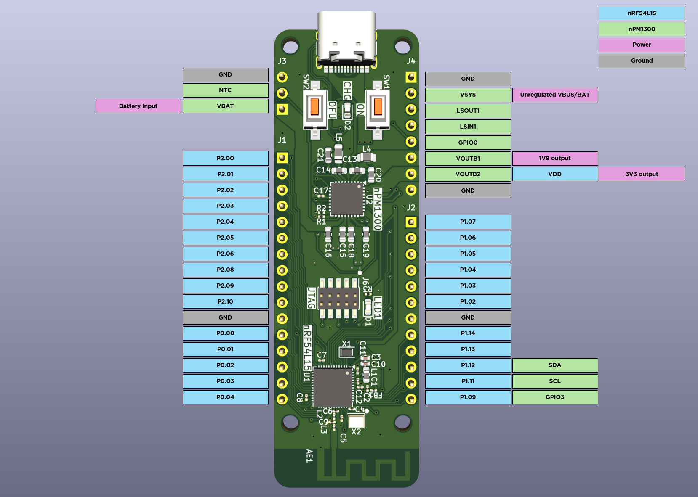

# nRF54L15_breadpower  

  

The nRF54L15_breadpower is a development board designed for breadboard prototyping with support for directly powering your breadboard project through USB-C, and battery power ing your final project with charging through USB-C. 
